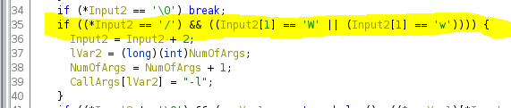

# Introduction
Preface: I took a different approach to solve this challenge than the intended solution.
This writeup is not an explanation of how Finger-in-the-shell is intended to be solved, it's my process of how I exploited it. For more info on the intended solution using shell code, I'd recommend checking the [official Magpie writeup.](https://github.com/infosec-ucalgary/magpieCTF-2021/tree/master/challenges/binary-exploitation/finger-in-the-shell)

## TL;DR
Entered the desired command (/bin/sh) as the "log file" input and used a stack buffer overflow and ROP Gadgets in the next input to call execv using the log file as the command to run.

## Tools used
 - Ghidra
> For static analysis
 - Evan's Debugger (edb)
> For dynamic analysis (debugging)
 - msf-pattern
> For finding buffer offsets.
> Could have also used pwn cyclic but didn't have it on hand
- ropper
> For finding ROP Gadgets
 - Python/PwnTools
> For exploit writing/testing

# Finding a bug
## Understanding the program
Since there was no source code, I jumped straight in and ran the program localy. “Getpeername: Socket operation on non-socket” ummm, that doesn’t look good. I’d better check that if that also happens when I connect to the server and that it’s not a problem on my end. It’s odd but it also happened on their end so it’s not a problem with my environment. Well let’s get back to trying to understand the program. So running it, it takes a “log file” string and some other string. Buffer overflow? 
<br/>

<br/>
Nope =(
<br/>
Maybe something is written to the log file? Nope.
## CType
Time to break out EDB. Stepping through, I came across an odd chunk of code. It was taking each input character, doubling it, using that as an offset to a table, and anding it with 0x2000. Was it looking for a specific character? What values in that table have the 0x2000 bit set? After spending a long time trying to figure it out, it turned out to be part of ctype and it was checking if there is a space in the input as was added by the compiler.
## /w?
Time to break out Ghidra. Looking through, I noticed an odd conditional statement.
<br/>

<br/>
It was checking for /w or /W. Maybe this could be overflown?
<br/>

<br/>
Again, not exploitable.
## Google
I was kind of at a loss at this point and had to try to search google. I searched for “finger worm” (a lot of odd results) and came across the wiki page for the Morris worm. Well that looks promising. Doing a bit of searching, I found that the worm used a buffer of ~512 bytes for the overflow. At that point I realized my mistake, I was using a buffer of only 200 bytes. \*facepalm\* 
<br/>

<br/>
Segmentation fault! I now had a foot in the door.

# Exploiting a bug
Let's open this up in EDB and see what this SegFault is.
<br/>

<br/>
Great, I can overwrite the return address, but which bytes in the 1000 byte buffer overwrote it? Time to bring out msf-pattern. Msf-pattern_create generates a string of non-repeating characters. You can then give msf-pattern_offset a small substring of that generated string (say, from a register) and it will give you the number of characters to the start of that substring. Running the command:
<br/>
```echo -e "text.txt\n$(msf-pattern_create -l 1000)\n" | edb --run ./finger-in-the-shell```
<br/>
gave me a return value of 0x7341357341347341 and plugging that into msf-pattern_offset gave me an offset of 552 bytes.
<br/>

<br/>
Great, I have control of the return address but where to return to? 
The execv function at the end looks juicy, lets try returning there and see what happens. Or at least that’s the plan, but using addresses and offsets in the CLI is a bit of a pain. Time to start writing our exploit. While we don’t know exactly how our exploit is going to work, we already know some key things: the offset to the return address, looking in ghidra we can see that the log file has a static address, and the address of the exec function. At this point, it’s a fairly simple script: print something for the log file, ‘A’*return_offset for padding, packed address of the exec function(pwn tools makes this easy), and maybe some more padding.
## Execv
I struggled with this bit for a while. With it failing silently, it made it hard to debug. I tried too many pointless things to list them all, most of which involved some form of setting the log file to some command and having the RBP point to it. I then did the smart thing and created a simple C program to see how Execv works. It turned out there were a lot of issues with the way I was trying to  use execv. First was that I was pointing directly to the string when I should have been pointing to a pointer that was pointing to that string. Secondly, I was trying to chain commands by using a “;” which does not work with execv. Third, I would have to change RDI (/usr/ucb/finger) to the command I wanted.
## ROP Gadgets
Well that kind of sucks but it’s time to find a new strategy. Since I had control of the return addresses, I decided to use ropper to look at possible ROP gadgets. ```TODO:EXPLAIN ROP GADGETS``` I noticed two ROP gadgets in particular, pop RDI and pop RSI.
<br/>

<br/>
I now had a new plan. Instead of calling the exec function from the start, I’d call the call to execv directly and set RDI and RSI myself using the ROP Gadgets.
## Home Stretch
I set the log file to “/usr/bin/pwd\0” plus a pointer back to itself. Set the first return to RDI ROP and set it to the log file, then called the RSI ROP and set it to the log file pointer I just made, called execv, AND IT WORKED!!! Time to test it on the actual server. And it doesn’t work. =( 
<br/>
I tried a lot of different things trying to figure out why it wasn’t working remotely. Issue with the socket? Something being filtered out in transit? After a bunch of testing, I changed /usr/bin/pwd to /bin/sh and it worked… Looking on the server, pwd wasn’t in /usr/bin/ but was instead in /bin/. \*facepalm\*
