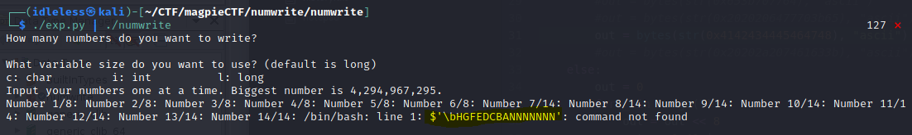

# Introduction
Preface: I do not know how this program works. I do not know how my exploit works. I accidentally stumbled into a solution and thought that this was supposed to be an easy challenge.
This writeup is not an explanation of how poly is intended to work, it's my process of how I exploited it. For more info on the intended solution, I'd recommend checking the [official Magpie writeup.](https://github.com/infosec-ucalgary/magpieCTF-2021/tree/master/challenges/binary-exploitation/numwrite)

## TL;DR
Found a bug when writing 4 or more numbers as char. Expanded this to an arbitrary write. Overwrote "output.txt" and changed it to "e;cat *";

## Tools used
 - Ghidra
> For static analysis
 - Evan's Debugger (edb)
> For dynamic analysis (debugging)
 - Python
> For exploit writing/testing

# Finding a bug
## Overview of the source
The first thing I looked at was the source code(numwrite.c) to get a quick idea of what the executable is and the probable way to win.
Going through top to bottom the key things I noticed were:
- Line 25: "Why did you add char as an option?!"
> Possible hint?
- Line 39: "execv("/bin/bash", args);"
> Well that looks like a probable way to win
- Line 88/89 and 101/106: scanf("%s", buffer)
> Buffer overflow?  
> YES!!! But checking in Ghidra, there is nothing after those buffers to overwrite... =(
- Line 110: input_numbers > 256
> Possible Off by One error? The max value of a char is only 255 and this will include 256.
> It wasn't from what I could tell. Just an arbitrary value.

## Understanding the program
So running the program, I can choose how many numbers I can write, size, and a value for each number. So what are some vulnerabilities I can use?
- Buffer overflow?
> I've already checked for the number of writes and the var size but maybe I missed something? Nope, even writing ~4000 characters up to the next read only memory didn't overwrite anything.  
> What about an overflow when inputting the numbers? Doesn't look like it and looking in the source code (line 70) shows them using scanf with "%ld" instead of "%s"
- Off by One?
> Is there some sort of edge case that was missed when using the numbers? Well let's try to set it to some extreme values: 0, -1, 4294967295, 4294967296, 999999999999. Still nothing.

At this point I noticed something odd that was staring me in the face, how was I setting values of 4294967295 to a char which has a max value of 255? 
Going back to the source code I found what I was looking for, lines 52 and 62: 
```
size = numbers * sizeof(char);  
list = (long *)alloca(size);
```  
They were treating all numbers as a long but only allocating space for the type requested. So if I created 4 chars(1 byte each), it would allocate 4 bytes but it would treat it like 4 longs which use 8 bytes each for a total of 24 bytes; way above the 4 allocated. Let's go back to numwrite and create a bunch of chars. 
<br/>

<br/>
SEGMENTATION FAULT! This is looking promising. 

## Exploiting the bug
### Echo String
Let's open it up in edb and see what I broke.
<br/>

<br/>
It seg faulted trying to write an odd number (0x6f686365) to a pointer I control. hmmm, that's odd but not too useful. Let's figure out what number I enter ends up being written to RAX. The easy way to do this would have been to just enter the number that matches each entry (ie, 1 for number 1, 2 for number 2, etc). Instead, out of habit of using letters as my inputs while testing, I created a script that would create the string of characters (ie, "AAAA\n" for number 1, "BBBB\n" for number2, etc) and convert it to an integer. While this does help make my numbers stand out, it just ate up a bunch of time.
<br/>
```Note: values that are over 32 bit may cause issues (infinite loop). This will be touched on later.```
> At this point, I kept making a mistake and it took me far longer than I'd like to admit to figure out what was going on. I kept changing how many numbers I wrote. This would cause the program to allocate a different size buffer which would then cause different numbers to overlap. At this point I realized that I needed to get some sleep. The next morning, I realized my mistake and used a fixed number of 8 numbers which I will be using for the remainder of this writeup for consistancy but I will be touching on this later in "Number of items".

So seeing that it was Segfaulting when trying to write to an address that the fourth number overwrote, I tried to point this at different writable locations and see if I could use it to create an arbitrary write thinking that it might be the item list pointer. Unfortunately, while it did create some odd output, I could not find anything too useful with it and was only the echo_string. I then ended up pointing it to an unused chunk of writable memory (0x4040c8, right after the buffer) to prevent the seg fault and moved on to find another possible exploit.
### Number of items
At this point I noticed that it would only write 6 values then stop. After going through the execution for a bit, I noticed that the number it was comparing the iterator to was changing to zero after the sixth value. Stepping through the execution, I saw that the higher 32bits of the sixth value was the count of the number of items. By changing this value, I was able to write any number items while maintaining the same base numbers (as mentioned before).
### List Pointer
I was now getting a new Segfault. It was now failing at the 12th item during the scanf call to add a number to the list. I again tried to point the 12th item to an arbitrary writable location and checked what it outputed there. It was writing the next numbers there as I was hoping. I had found the list pointer and with it, and a way to make an arbitrary write. But now I needed to find what and where to write. I first tried the /etc/bash command but that was read-only as well as the options passed to it. I then thought I could overwrite the echo command but that was written in code and wasn't written yet. I then had the idea of overwriting "output.txt" and when I checked it, it was in writable memory! If I was able to overwrite it, then instead of the program running "echo '1,2,3,...' > output.txt" to save the numbers, I could change it to "echo 1,2,3,...' > e;(any command I wanted)". 
## Creating the Payload
At first I tried to run the command pwd by overwriting it with "e;pwd" but it failed... 
<br/>

<br/>
"\bdwp" not found??? "e" not found??? I then thought, maybe the string was reversed, if you flip "\bdwp" around you get "pwdb\", the string I was expecting and some junk. I then tried the string "ABCDEFGH" and got "\bHGFEDCBANNNNNNNN"; my string was being reversed. 
<br/>

<br/>
There was some other junk so I decided to add a few spaces after to try and pad by string. I then tried the string "   dwp;e" and it worked!!
<br/>

<br/>
I then tried it on the server and it worked there was well! So now I had to read the flag. At first I was planning on running the command "e;cat flag.txt" but that would be too long to fit in a single 8 byte number and was going to be more work than I wanted to split it into 2 numbers. I instead shortened it to ";cat \*". Trying it locally printed all my files as expected. So far so good, time to try it on the server... IT WORKED!!! I could see the flag.

